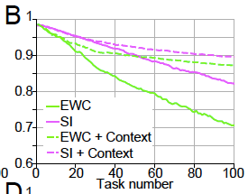
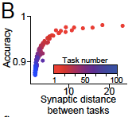
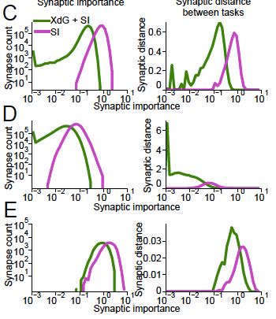

========================
Catastrophic Forgetting
========================

A summary of `Alleviating Catastrophic Forgetting Using Context-Dependent Gating and Synaptic Stabilisation <https://arxiv.org/pdf/1802.01569.pdf>`_ (Masse, Grant, Freedman). With my interpretations and thoughts sprinkled in. Jumping-off points are written as footnotes.

--------

Intro
=======

Without additional measures, neural networks are pretty bad at *continual learning* - the ability to learn new tasks without forgetting how to do previously learned tasks. This failure to continually learn is what we call *catastrophic forgetting*. 

Catastrophic forgetting occurs because as a neural net learns a second task, its parameters move towards the optimum for the second task - and thus away from the optimum for the first task. This problem gets even worse as you learn more and more tasks. 

One moderately successful remedy is weight stabilisation. The idea is that when learning a new task, you want to constrain parameter change in order to minimise the forgetting of previous tasks. Furthermore, you want to constrain important parameters more (important to previous tasks). The figure below shows the success of two stabilisation techniques at alleviating forgetting on the permuted MNIST task (the two techniques will be expounded on later). 

	Figure 2A in the paper.

.. admonition:: pMNIST
	
	Permuted MNIST (pMNIST) is an example of a "input reformatting" problem. Sequential learning is tested on identical input/output semantics, but changing input format. In pMNIST, the image pixel intensities (input semantics) and digit labels (output semantics) are kept the same, but the pixel locations (input format) are changed. Specifically, each new task has a fixed permutation that is applied to all input images. 

The innovation presented by the paper is to pair weight stabilistion with context-dependent gating (XdG). In XdG, the neural network uses (randomly sampled, potentially overlapping) subsets of the neural network for each task. The idea is that we want to ease the burden on parameters - each parameter is now responsible for learning fewer tasks, and thus doesn't move as much from its last position (after learning the most recent task). The pairing of stabilisation and XdG results in a breakthrough in alleviating forgetting, as you can see in the figure below. 

	Figure 2D in the paper.

With the efficacy of the method established, we turn to understanding each remedy individually and how they combine. 

Weight Stabilistion
====================

Weight stabilisation can be thought of as a form of regularisation that penalises moving away from previous parameters. Moreover, moving away from important parameters is punished more heavily than moving away from less important parameters. Mathematically, we add a penalty like so: 

.. math::
	L = L_k + c \sum \limits_{i} \Omega _i (\theta_i - \theta_i^{\text{prev}})^2

.. admonition:: Notation

	- :math:`L_k` is the unstabilised loss while learning task :math:`k`
	- :math:`\theta_i` is parameter :math:`i`
	- :math:`c` is a scaling hyper-parameter
	- :math:`\Omega _i` is the "importance" of parameter :math:`i` to previously learned tasks 

How is :math:`\Omega_i` computed? Firstly, the importance of :math:`\theta_i` to each previous task is simply summed to form its total importance to all previous tasks. Assuming we're currently learning task :math:`k`, 

.. math::
	\Omega_i = \sum\limits_{m < k} \Omega _{i}^{k}

Now, there are different ways to define :math:`\Omega _{i}^{k}`, the "importance" of parameter :math:`i` to task :math:`k`. This paper uses two different methods - elastic weight consolidation (EWC) and synaptic intelligence (SI). 

**Elastic weight consolidation (EWC)** defines importance as:

.. math::
	\Omega_{i}^{k} = E_{X\sim D^k, y\sim P_{\theta}(y|x)} \Big(\frac{\partial log p_{\theta_i}(y|x)}{\partial \theta_i} \Big)^2 

That is, we take the diagonal elements of the Fisher Information matrix:

.. math::
	F = E_{X\sim D^k, y\sim P_{\theta}(y|x)} \Big(\frac{\partial log p_{\theta_i}(y|x)}{\partial \theta_i} \Big)^2 

.. admonition:: Notation

	- :math:`D^k` is the input data for task :math:`k`
	- :math:`p_{\theta_i}(y|x)` is the output distribution defined by the neural net

This definition of "importance" bears an intuitive interpretation. If slightly perturbing a parameter results in a significant change in the output distribution, that parameter is important to maintaining the output distribution (and thus not forgetting it). [#]_

**Synaptic intelligence (SI)** defines importance as:

.. math::
	\Omega^{k}_{i} &= max \Big( 0, \frac{w^{k}_{i}}{(\Delta \theta_i)^2 + \xi} \Big) \\
	\Delta \theta_i &= \sum\limits_{t} (\theta_i (t) - \theta_i (t-1)) \\
	w_i^k &= \sum\limits_{t} (\theta_i (t) - \theta_i (t-1)) \cdot - \frac{\partial L_k(t) }{\partial \theta_i (t)}

.. admonition:: Notation

	- :math:`(\Delta \theta_i)^2` is the normalising term
	- :math:`\xi` is the damping hyper-parameter
	- :math:`t` here refers to batch number (within training for a single task)

This definition of importance needs a little more unpacking than EWC. Let's start by inspecting :math:`w_{i}^{k}`.

:math:`(\theta_i (t) - \theta_i (t-1))` represents the direction (sign) and magnitude of the parameter change. But since this term will get normalised anyways, only the direction of the change really matters.

:math:`- \frac{\partial L_k(t) }{\partial \theta_i(t)}` is meaningful both in direction and magnitude. As long as we're not at a local extremum, its direction indicates which way to go from :math:`\theta_i(t)` in order to locally decrease loss. Its magnitude tells us how much a small step in that direction will decrease the loss.

It's important to realise that :math:`(\theta_i (t) - \theta_i (t-1))` represents the parameter change from the just-completed batch, while :math:`- \frac{\partial L_k(t) }{\partial \theta_i(t)}` roughly represents the desired parameter change for the upcoming batch. If their signs disagree, that means that :math:`\theta_i` needs to reverse course - meaning that the last parameter change was not useful! 

We can thus interpret :math:`\Omega^{k}_{i}` here as capturing how much :math:`\theta_i` moved in a useful direction while learning task :math:`k`. There seems to be the underlying assumption that if :math:`\theta_i` moved a lot in a useful direction while learning task :math:`k`, that parameter must be important to task :math:`k`. [#]_

Gating
=======

The paper presents a sequence of ideas naturally leading up to context-dependent gating (XdG). 

**Context signalling** is the first idea presented. It is motivated by the idea that catastrophic forgetting might partially be the result of the neural net not knowing what context its currently being tested on. So we invent a "context signal," a one-hot vector encoding what context is currently being tested. The paper says that this one-hot vector is then "projected" onto the hidden layers, and that the weights projecting the context signal onto the hidden layers could be trained by the network. As you can see in Figure 2B below, context signalling combined with stabilisation is an improvement upon stabilisation alone. 

.. admonition:: Question

	I'm actually not sure what this "projecting" means. I initially thought that projecting meant applying a differentiable context-dependent mask onto the hidden layers, but how can such a mask be applied without training? 

.. figure:: ./images/forgetting_context_signal.png
	:align: center

	Figure 1B in the paper.

	Figure 2B in the paper.

The **split network** is motivated by a desire to decrease the number of tasks each parameter is involved in learning. The network is split into five sub-networks with 733 hidden neurons each (so that the total number of weights remains the same). One sub-network is used for each task (with the other hidden neurons zeroed). Choosing the number of sub-networks involves a trade-off between allevating forgetting (more sub-networks) and maintaing representational power per task (less sub-networks, thus more hidden neurons per task). As you can see in Figure 2C below, split networks in combination with context signalling and stabilisation is our best remedy yet.

	Figure 1C in the paper.

.. figure:: ./images/forgetting_2c.png
	:align: center

	Figure 2C in the paper.

**Context-dependent gating (XdG)** assigns unique (potentially overlapping) sub-networks for each task. It does this by gating (i.e. zeroing) :math:`X\%` of hidden neurons, randomly chosen for each task. [#]_ In the paper, :math:`X=80` to allow fair comparison with the split network. Again, the choice of :math:`X` is a trade-off between alleviating forgetting via keeping more weights fixed, and maintaing per-task representational power by keeping more hidden neurons active. XdG combined with stabilisation gives the best results yet. Interestingly, XdG only works when combined with stabilisation... 

.. figure:: ./images/forgetting_1d.png
	:align: center

	Figure 1D in the paper.

.. figure:: ./images/forgetting_2d.png
	:align: center

	Figure 2D in the paper.

The paper shows that the XdG and stabilisation method works on two other tasks. The first task was sequential learning of ImageNet (the network learned 10-class subsets of 1000 total classes). The second task was a series of eye saccade tasks. Notably, XdG and stabilisation successfully alleviated forgetting on a network trained using RL (to perform the second task). 

The interaction between XdG and stablistion
============================================
This is my favorite part of the paper, where the authors try to understand why XdG combined with stabilisation works better than stabilisation alone. They do this by making a series of hypotheses, and testing them empircally - science!

The core argument is "that to accurately learn many sequential tasks with little forgetting, the network must balance two competing demands:"

1. "it must stabilise synpases that are deemed important for previous tasks"
2. "yet remain flexible so that it can adjust synaptic values by a sufficient amount to accurately learn new tasks." 

The importance of the first demand, stabilising important weights, was empirically tested via an experiment in which individual weights in a trained network are perturbed by a fixed amount and the corresponding change in accuracy is measured. As expected, the authors found a strong negative correlation between the synaptic importance of the perturbed weight and the corresponding change in accuracy (R = -0.904). 

.. figure:: ./images/forgetting_3a.png
	:align: center

	Figure 3A in the paper.

The importance of the second demand, allowing weights to change sufficiently, was shown by plotting distance moved in parameter space while learning a new task, and the accuracy achieved on that task. Recall that the importance of a parameter is summed over all previous tasks, so the importance of a parameter accumulates as it is involved in more tasks.

	Figure 3B in the paper.

So why does XdG help balance these two demands? The authors claim that XdG results in lower mean importance and "having larger number of synapses with low importance." In turn, this means that low-importance parameters can be adjusted without hurting performance on previous tasks. That is, XdG means that we can fulfill demand two at a lower cost to demand one. This claim is validated by the figure below, from data collected while learning the 100th MNIST permutation. [#]_

	Figures 3C-E in the paper. C shows the weights between the input layer and the first hidden layer, D shows the weights between the first and second hidden layers, and E shows the weights between the second hidden layer and the output layer. 

.. _observations:

.. admonition:: Observations & Questions about Figures 3C-E

	- It's interesting to note the range of the synaptic distance moved plots (right panels). The weights in D move an order of magnitude more than the weights in C, which in turn moves an order of magnitude more than the weights in E. Here's a guess as to why. The weights in C are less task-specific than the weights in D because the first hidden layer should encode basic features such as edges. The weights in D are the most task-specific because they encode geometric shapes that are combinations of building blocks such as edges. The weights in E are the least task-specific because presumably its easier to change the hidden layer features than to change the combnination of features since the features are so task-specific? I'm really not sure though, this is a really kooky guess...
	- The peaks are interesting to note too. In Figure C, the peaks on the left and right panels are almost identically located. I guess this is because high-intensity pixels tend to cluster near the center of images of digits. In Figure D, we see that the green peak on the right panel is very far away from the green peak. I guess this is because the network has some liberty as to which neuron encodes what features and there's redundancy amongst the features learned in the first hidden layer.
	- Why does there seem to be more weights with non-zero importance when XdG is used? One guess is that the reduced number of parameters per-task means each parameter is more "needed."

Transfer Learning
==================
The paper suggests that gating can be used to facilitate transfer learning. Instead of re-training a neural net to perform a new task, we can train a gating function to combine sub-networks in order to perform the new task. 

The underlying assumption here is that there exist sub-networks which learn composable concepts. It's certainly reasonable to think that we can design networks to learn composable concepts. For instance, it's been shown that `auto-encoders have structured latent-spaces <https://distill.pub/2017/aia/>`_. `Convolutional nets seem to build concepts up compositionally <https://distill.pub/2018/building-blocks/>`_. And of course, word embeddings have 'king' - 'man' + 'woman' = 'queen'. One can imagine teaching a CNN to classify zebras if it's learned to classify horses ('zebra' = 'horse' + 'stripes'). 

The authors identify three opportunities to make progress on transfer learning:

1. Algorithms for identifying what "network modules," or sub-networks, are useful for a new tasks (and how to combine them). 
2. Algorithms for identifying the current context, and performing gating accordingly.
3. Networks that represent learned information in a modular manner. 

Jumping-off Points
====================
.. [#] The point of EWC seems to be to minimise the shift of the output distribution :math:`p_{\theta}(y|x)` - so can we instead use a KL-divergence penalty such as :math:`KL(p_{\theta_{t}}(y|x), p_{\theta_{t+1}}(y|x))`? Can we phrase other ideas presented in this paper in an information theoretic manner?

.. [#] 	Why does SI work better than EWC? To me, EWC seems better justified than SI . The underlying assumption behind SI seems iffy. Yes, if a parameter needs to be changed a lot in order to perform a task, it must be important to doing that task well. But what if we have an already-learned parameter which is also important for the current task? For example, weights in a CNN that act as edge detectors seem useful for any visual task.

.. [#] 	Is XdG related to dropout? They both seem intended at distributing representational power. They both seem to be mixtures of experts where experts share paremeters. They differ in how they combine experts. XdG uses only one expert at a time, since contexts are discrete and are observed with total certainty. On the other hand, dropout assumes total ignorance about the context (and context refers to batch-wise distribution). That is, dropout always gives equal weight to each expert. I'm not sure how insightful this observation is, but it seems interesting... Reading into the literature on mixture models seems relevant to the problem of applying XdG to transfer learning.

.. [#] 	But why are there more low-importance weights? The obvious reason is that each parameter is now involved in learning fewer tasks - so each parameter accumulates importance at a slower rate. But this is also true for split networks, and XdG is better than split networks, so there there's more work to be done in explaining why XdG is so successful...

**Some more jumping-off points:**

- The measures of importance used in stabilisation seem applicable to model compression. Also, model compression between tasks seems like it might help alleviate catastrophic forgetting...
- Can we explain these observations_ about Figures 3C-E?
- The methods of parameter importance used in EWC and SI seem applicable to feature attribution. It'd be interesting to try these methods of feature attribution in combination with feature visualisation, as presented in `Building Blocks <https://distill.pub/2018/building-blocks>`_ Moreover, feature visualisation can help us better understand why XdG and stabilisation works. For instance, we can visually compare neurons with lower mean importance to neurons with higher mean importance.
- Do stabilisation techniques have a relation to the replay buffer? 
- And of course, applying gating to transfer learning...
